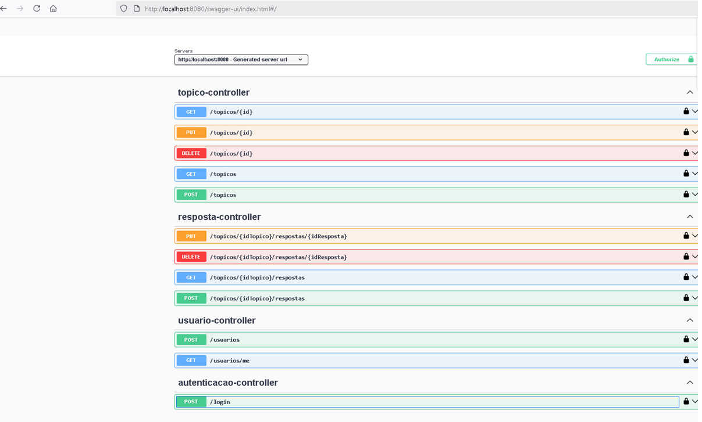
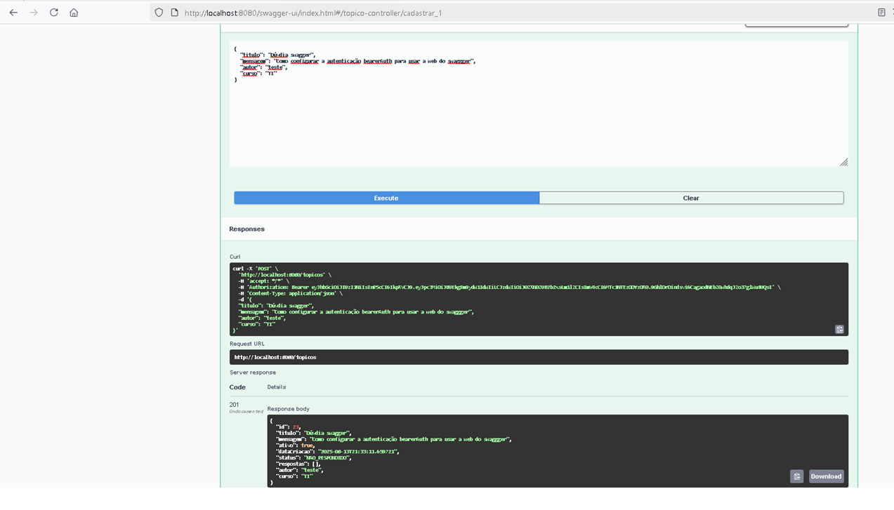

# 📌 FórumHub API




## 📖 Descrição

Um fórum é um espaço onde todos os participantes de uma plataforma podem colocar suas perguntas sobre determinados assuntos. Aqui na **Alura**, os alunos e alunas utilizam o fórum para tirar suas dúvidas sobre os cursos e projetos em que estão participando. Este ambiente é rico em **aprendizado** e **colaboração** entre alunos, professores e moderadores.

O **FórumHub** é um desafio que replica o funcionamento do fórum no **back-end**, criando uma **API REST** com autenticação, persistência de dados e operações completas de CRUD para tópicos e respostas.

---

## 🎯 Objetivos do Projeto

- Implementar uma API REST seguindo as boas práticas do modelo REST.
- Permitir a criação, listagem, atualização e exclusão de tópicos e respostas.
- Implementar autenticação e autorização com JWT para proteger os endpoints.
- Utilizar banco de dados relacional para persistência das informações.
- Aplicar validações de acordo com as regras de negócio.

---

## 📚 Funcionalidades

- **Tópicos**
  - Criar um novo tópico (`POST /topicos`)
  - Listar todos os tópicos (`GET /topicos`)
  - Buscar um tópico por ID (`GET /topicos/{id}`)
  - Atualizar um tópico (`PUT /topicos/{id}`)
  - Excluir um tópico (`DELETE /topicos/{id}`)

- **Respostas**
  - Adicionar resposta a um tópico (`POST /topicos/{idTopico}/respostas`)
  - Listar respostas de um tópico (`GET /topicos/{idTopico}/respostas`)
  - Atualizar resposta (`PUT /topicos/{idTopico}/respostas/{idResposta}`)
  - Excluir resposta (`DELETE /topicos/{idTopico}/respostas/{idResposta}`)

- **Usuários**
  - Criar usuário (`POST /usuarios`)
  - Buscar dados do usuário logado (`GET /usuarios/me`)

- **Autenticação**
  - Login para receber token JWT (`POST /login`)

---

## 🛠 Tecnologias Utilizadas

- **Java 22**
- **Spring Boot**
- **Spring Security** (JWT)
- **Spring Data JPA**
- **Hibernate**
- **MySQL**
- **Swagger (OpenAPI)** para documentação interativa
- **JUnit 5** e **MockMvc** para testes

---

## ⚙️ Configuração

### Variáveis de Ambiente

Crie um arquivo `application.properties` ou use variáveis de ambiente:

```properties
spring.application.name=forumhub
spring.datasource.url=jdbc:mysql://${DB_HOST:localhost}/${DB_NAME}
spring.datasource.username=${DB_USER}
spring.datasource.password=${DB_PASS}

spring.jpa.hibernate.ddl-auto=validate
spring.jpa.show-sql=true
spring.jpa.properties.hibernate.format_sql=true

api_key=${API_KEY}

▶️ Como Executar

Clone este repositório:

git clone  https://github.com/claudiomiromarques/forum_hub_api_challenge.git


Entre na pasta do projeto:

cd forumhub


Configure o banco de dados no application.properties ou via variáveis de ambiente.

Execute a aplicação:

mvn spring-boot:run


Acesse a documentação da API:

http://localhost:8080/swagger-ui/index.html

🧪 Testes
Para rodar os testes:

mvn test

📷 Imagens do Projeto
Endpoints no Swagger

Cadastro de Tópico via Swagger

📜 Licença

Este projeto é distribuído sob a licença MIT. Veja o arquivo LICENSE para mais detalhes.
